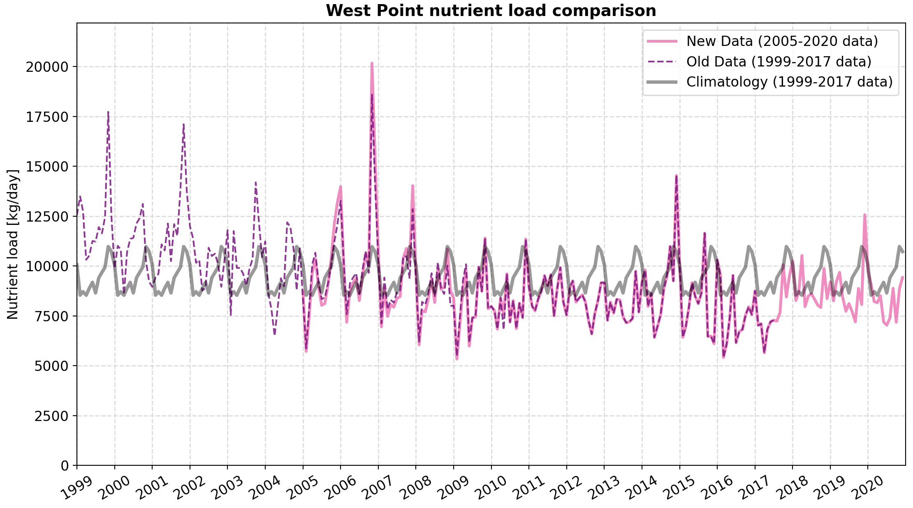

## Integrating new WWTP data

This week I focused on integrating new [Ecology/USGS point source data](https://www.sciencebase.gov/catalog/item/64762b37d34e4e58932d9d81) into LiveOcean.

As it turns out, the new data is a tougher beast to tame than I anticipated. There is still quite a lot of work to be done. However, I managed to identify several idiosyncrasies that warrant some discussion. More details below.

---
## Data overview

The new Ecology/USGS point source data were developed as input data for a [SPARROW watershed model](https://essopenarchive.org/users/883361/articles/1264697-preprint-simulated-seasonal-loads-of-total-nitrogen-and-total-phosphorus-by-major-source-from-watersheds-draining-to-washington-waters-of-the-salish-sea-2005-through-2020).

The point source data include 47 fish hatcheries, 20 industrial facilities, and 97 WWTPs across US Salish Sea waters. The old dataset only had 10 industrial facilities and 87 WWTPs. 

For each of these facilities, the dataset provides nutrient loading estimates at a monthly temporal resolution from 2005 to 2020, inclusive. These data are primarily derived from reports generated by the facilities. Multiple linear regression models were used to estimate loads when there were lapses in the data.

---
## Rationale for using new data

The new data provide more accurate estimates of WWTP loads through 2020, whereas the old data set ended in mid-2017. Thus, we could use loading data for individual years for the full duration of my "loading / no-loading" experiment.

Figure 1 shows an example comparison of the old data, new data, and climatologies (based on old data) for the West Point WWTP.

 Fig 1. Time series comparison of West Point nutrients loads.
 

---
## Decision to omit hatchery and industrial facility data

One issue I had with these data were that only WWTPs had consistent flow and nutrient data. Some of the industrial facilities, and all of the fish hatcheries, had only nutrient loads (after flow and nutrient concentrations are already multiplied together). Therefore, I cannot accurately add these hatchery and industrial facility data to LiveOcean without guessing the flow and nutrient concentrations. Thus, **I have decided to omit all fish hatchery and industrial facility data**.

The older Ecology dataset included flow and nutrient data for *some of the industrial facilities*. Though it is feasible to use the older dataset for these industrial facilities, I feel that mixing two datasets might lead to confusion for future model users. Additionally, nutrient permits only apply to WWTPs and not to industrial facilities. If I included industrial facilities in the model, I would need to create a special case to treat WWTPs and industrial facilities differently when I set nutrient loads to zero in my "no-loading" run. Therefore, it seems justifiable to omit industrial facility data from the model inputs.

---
## Special case WWTPs

---
## Other state variables

Temperatue, DO, total alkalinity, and TIC were not included in the new dataset. However, they are required inputs to LiveOcean. 

