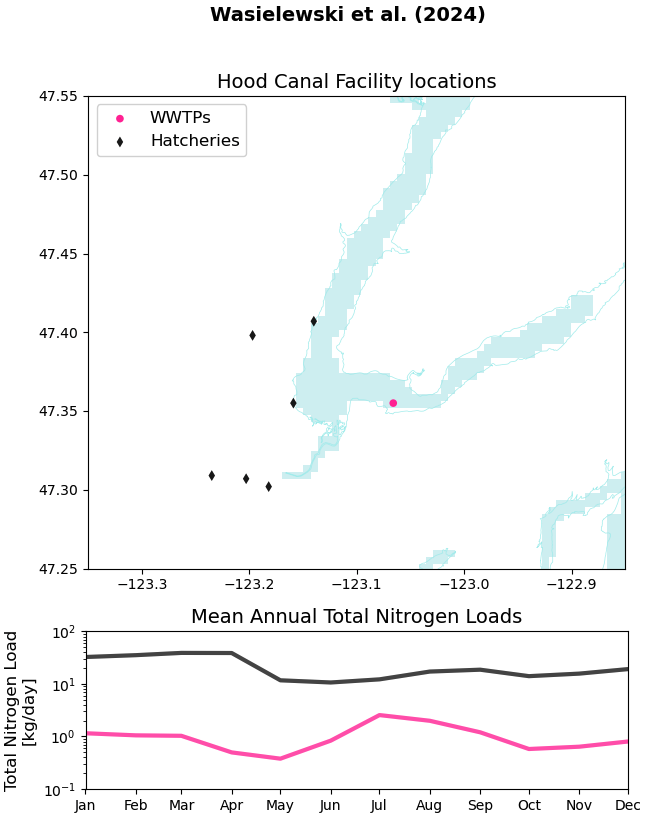
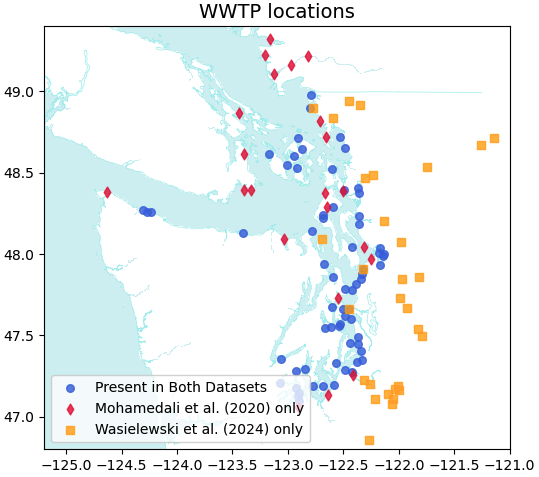
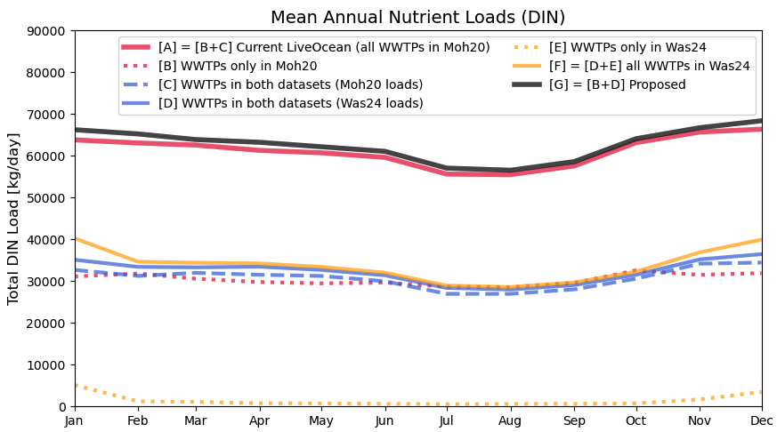

## More on WWTPs

This week I continued with the WWTP integration. Though this effort is not yet complete, I am making progress and hope to wrap up in in the next few days.

This blog post covers some of the loose ends from last week.

---
## Hood Canal loads

Last week, we agreed that I will only include WWTP loads and will omit hatchery and industrial facilitiy loads.
However, Parker noticed that there is only one WWTP in Hood Canal, but many fish hatcheries. Do the fish hatcheries contribute more nitrogen than the WWTP? As it turns out, yes, the sum of the hatcheries contributes more than one order of magnitude more TN than the WWTP (Fig 1).

 Fig 1. Top panel: locations of WWTPs and hatcheries in Hood Canal (from the Wasielewski et al., 2024 dataset). Bottom panel: climatology nutrient load profiles for the sum of each type of facilitiy (e.g., black is the climatology for the sum of all hatcheries).
 

I have two thoughts on this issue:

1. Our experiment may not be compromised, because my main question is "how do WWTP loads influence DO in Puget Sound?". Therefore, our experiment will be considering the sensitivity of the system to whether the WWTP loads are present or absent. Additionally, the WWTPs under close watch are the large ones located in Main Basin. The Hood Canal-based point sources are not the primary focus of this experiment. 
2. On the flip side, we need to keep in mind that the WWTP loads only account for a small fraction of the TN that is entering Hood Canal from Hood Canal-based anthropogenic point sources. Therefore, our loading/no-loading experiment is not a good way to tell how much Hood Canal-based point sources influence local DO. Furthermore, the baseline amount of nitrogen entering Hood Canal may be inaccurate due to the omission of fish hatcheries.
    - *An interesting follow-up question or future experiment*: how much do the small Hood Canal-based anthropogenic point sources influence DO in Hood Canal relative to the large loads in Main Basin?

Moving forward, I could try to add the hatcheries to LiveOcean as well. However, as Alex reminded us, this may eat into our tight timeline.

I'm interested to discuss more now that we have more information.

---
## Corrected WWTP nutrient loads

I will not discuss Figures 2 and 3 in detail, because I already showed them in last week's blog post. However, I am re-posting them because I have corrected an error in which I was plotting TN instead of DIN for the new dataset (Wasielewski et al., 2024). 

None of my conclusions from last week have changed. However, some of the lines in Figure 3 have shifted slightly.

 Fig 2. WWTP locations. Blue means that the WWTP is present in both datasets, and the lat/lon info comes from Mohamedali et al. (2020). Red means the WWTP is only in Mohamedali et al. (2020). Yellow means the WWTP is only in Wasielewski et al. (2024).
 

 Fig 3. Nutrient loading climatologies for the sum of all WWTPs belonging to a specific group.
 
