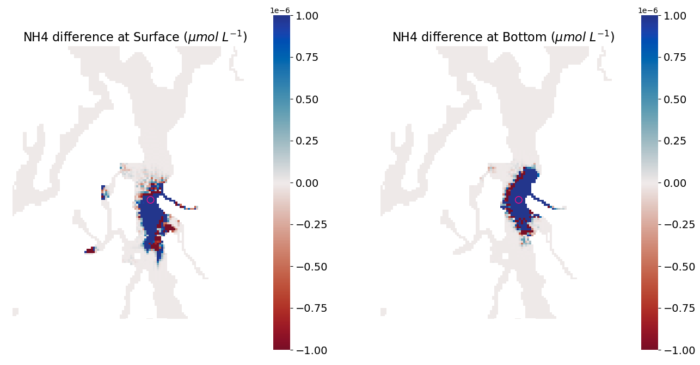
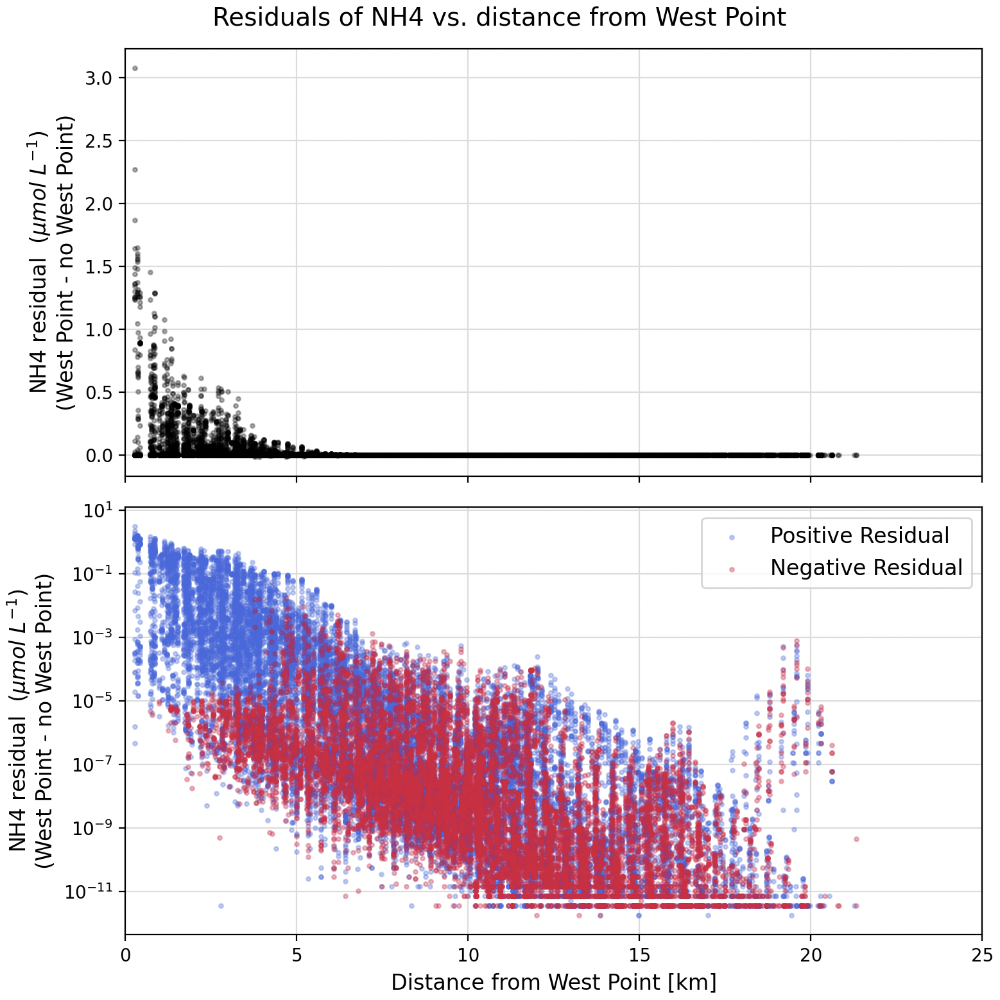

## Investigating noise via residuals

This week I continued to investigate noise in the biogeochemistry fields using West Point as a test source of nutrients.

Although I was unable to finish all my ensemble runs, this blog post describes the test runs and analyses that I have planned.

---
## Reminder of the problem and test set up

For my test experiments, I had previously been comparing a run with no nutrients from West Point to a run with nutrient from West Point. After one day of run time, the surface and bottom difference in NH4 shows signs of noise (Figure 1).

 Fig 1. Comparison of NH4 concentration after one day of run time between the two runs (West Point minus no-West Point). The left panel shows surface differences. The right panel shows bottom differences. The pink circle denotes the location of West Point WWTP.
 

---
## New analysis figure

Using the same model runs as Figure 1, I developed Figure 2 as a new way of visualizing the noise in the biogeochemistry fields. Figure 2 plots all of the locations in the LiveOcean grid where NH4 differs between the two runs-- at any lat/lon location and at all vertical layers. Locations where NH4 is equal in the two model runs are not shown on this figure.

The top panel plots the difference in NH4 concentration (residual) between the two model runs as a function of radial distance from West Point. As we might expect, the difference in NH4 is highest near West Point, and steeply drops off the further away from West Point we look.

The bottom panel plots the same information, except the y-axis now uses a log-scale so we can see the smaller scale residuals more easily. To accomodate negative values on a log-scale plot, I took the absolute value of all residuals, and colored them blue if they were originally positive, and red if they were originally negative.

What stands out to me is the peak near the 20 km distance in the bottom panel. My hunch is that this noise corresponds to Sinclair Inlet in Figure 1. It is roughly two orders of magnitude smaller than the actual NH4 signal near West Point.

 Fig 2. Residuals of NH4 (i.e. With West Point run minus no West Point run). 
 

My idea is to make similar figures for all of the test conditions listed in the following section, and my goal is to identify the scale of the biogeochemisty noise floor. I expect that a small enough nutrient concentration discharge from West Point will cause Figure 2 to appear flat. A flat trend would imply that the signal of NH4 is smaller than the biogeochemistry noise. 

---
## Experimental set up

I have forcing and dot_in files prepared for 5 test scenarios. For each scenario, I will compare the model output to a baseline run with no nutrient discharge from West Point and I will generate a residual plot (Figure 2) after 1, 3, 5, and 10 days of run time. My test scenarios are:

- West Point with full nutrient concentrations
- West Point with 50% of its nutrient concentrations
- West Point with 10% of its nutrient concentrations
- West Point with 1% of its nutrient concentrations
- West Point with nutrient concentrations of 1e-6 mmol/m3

Re-running West Point with full nutrient concentrations will also allow me to test whether the biogeochemsitry noise is deterministic and the same across identical runs, or whether the noise itself varies across identical runs.
