## Process-driven site selection for OAE

In addition to five test bed sites throughout the domain, we are selecting five sites that span a range of process parameter space to test OAE deployments in the LiveOcean model. Right now, I have a list of seven sites under consideration (Fig. 1). 

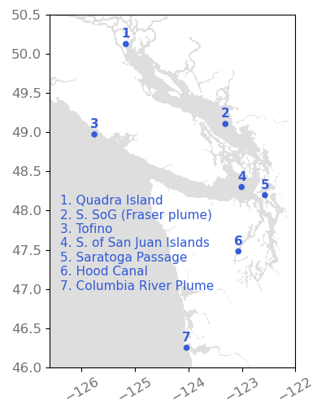 Fig 1. Seven sites under consideration for OAE deployments in LiveOcean.
 

This blog post details the processes we are considering for site selection, including:
- Freshwater content
- CO2 uptake capacity
- Wind speed
- Mixed layer depth
- Tidal currents
- Surface dye concentration

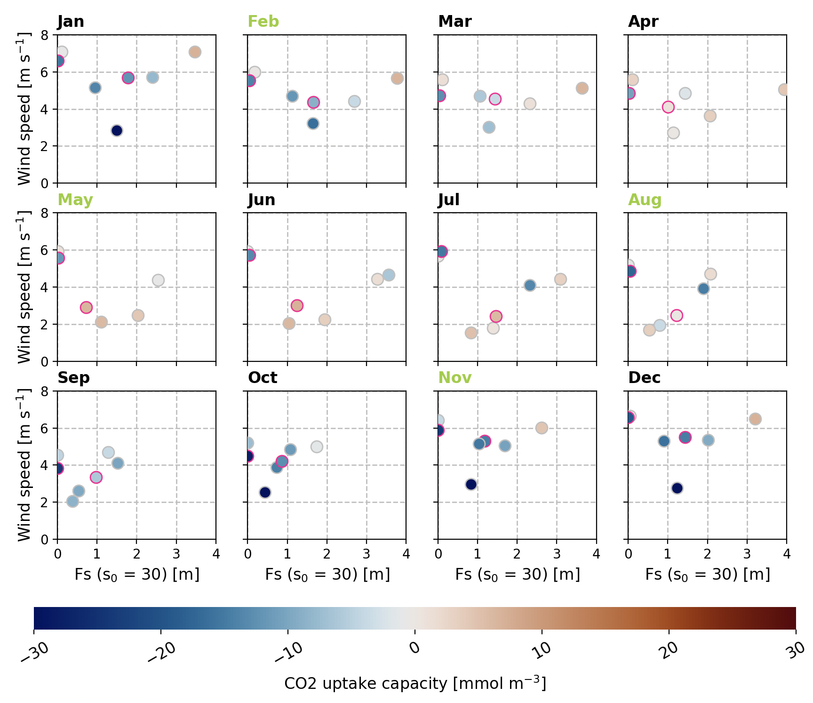 Fig 2. Site process parameter space. Each panel shows monthly averages using data pooled from 2015-2024. Every dot represents one of the seven sites under consideration. Pink dots are Quadra Island and S. of San Juan Islands, which are sites that I am considering eliminating. Months colored in lime green are months that I tested during my surface dye experiments. Monthly average wind speed is plotted on the y-axis, freshwater content (s0=30) on the x-axis, and the dots are colored by CO2 uptake capacity.
 

---
## Freshwater content

Freshwater content is a metric for the strength of river influence on a site. Following the methods of Mazzini et al. (2014), we calculate freshwater content as:

$$ F_s(x) = \int^0_{-D(x)} \frac{s_0 - s(x,z)}{s_0} dz $$

where s_0 is the reference salinity, D(x) is the depth at which the reference salinity occurs, and s(x,z) is the measured salinity. Essentially, Fs is a measure of the depth of the water column that is comprised of solely freshwater. 

For this analysis, I selected a reference salinity of **s_0 = 30** based on salinity profiles in thirteen terminal inlets in Puget Sound. In contrast, Mazzini et al. (2014) used s_0 = 32.5, but nearly all water in Puget Sound has salinity < 32.5, and using and s_0 of 32.5 recovered what looked like bathymetry. Thus, s_0 = 30 provides more meaningful results across the domain we are considering.

I calculated freshwater content in every grid cell on every day between 2015 - 2024, and pooled the data from these ten years to create monthly average maps. Maps for Feb, May, Aug, and Nov are shown in Figure 3. 

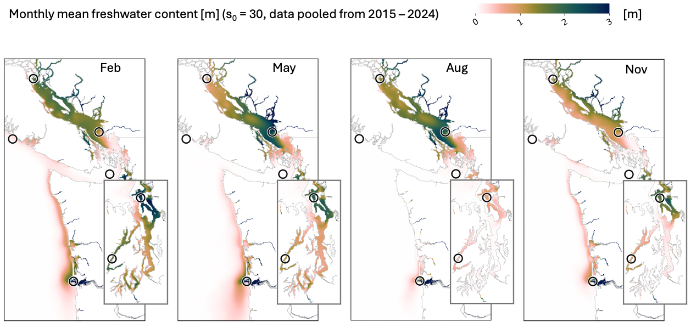 Fig 3. Average freshwater content across 10 years of simulations (2015-2020) during the months of Feb, May, Aug, and Nov. Circles denote the locations of the seven sites under consideration.
 

The locations with the highest freshwater content include the Columbia River plume, Skagit River plume, and Fraser River plume. 

Climatologies of Freshwater content at each of the seven sites are provided in Figure 4.

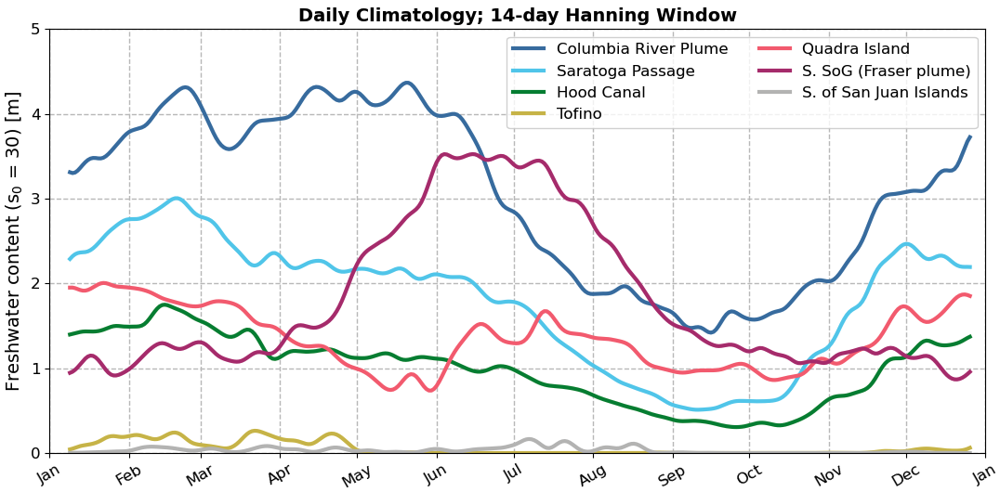 Fig 4. Freshwater content climatologies at each of the seven sites under consideration.
 

Based on these climatologies, it appears that the selected sites span a range of freshwater content-- which is what we hope for:
- The river plume locations (Columbia, Fraser, and Saratoga Passage) generally have higher freshwater content compared to the other sites. Between these three river plume locations, the Columbia has the highest overall freshwater content. Saratoga Passage has a similar seasonal pattern to the Columbia, but with a smaller freshwater content. The Fraser plume has a different seasonal profile (likely due to peak flow driven by snow melt during late fall), and its freshwater contents varies from being lower than the other plumes during the winter, to being the highest in mid-summer.
- Hood Canal and Quadra Island locations have moderate river influence, and maintain a mid-level freshwater content throughough the year.
- Tofino and just south of the San Juan Islands have limited freshwater influence throughout the year.

Because Quadra and Hood Canal look similar, and Tofino and S. San Juan Islands look similar, I am considering eliminating one of each pair.

---
## CO2 uptake capacity

CO2 uptake capacity tells us how much CO2 could be absorbed (or outgassed) by the surface ocean based purely on temperature, salinity, and the difference in pCO2 between the atmosphere and ocean. 

Figure 5 shows the monthly average maps of CO2 uptake capacity in units of mmol/m3-- the amount of CO2 that could dissolve (or be outgassed). Positive values (red) mean ocean absorption, while negative values (blue) mean ocean outgassing.

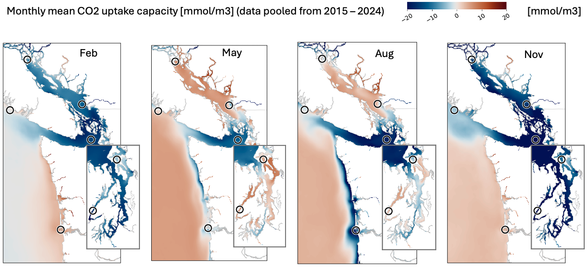 Fig 5. Average CO2 uptake capacity across 10 years of simulations (2015-2020) during the months of Feb, May, Aug, and Nov. Circles denote the locations of the seven sites under consideration.
 

Note that the actual rate at which CO2 gas transfer occurs between the ocean and atmosphere is also dictated by wind speed. Figure 6 shows actual CO2 flux taking into account both CO2 uptake capacity (Fig. 5) and wind speed. 

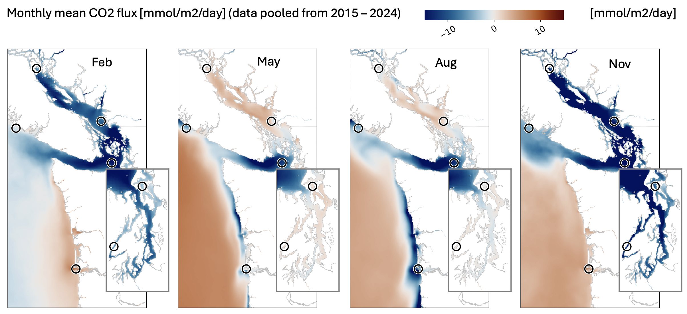 Fig 6. Average CO2 flux across 10 years of simulations (2015-2020) during the months of Feb, May, Aug, and Nov. Circles denote the locations of the seven sites under consideration.
 

Climatologies of CO2 uptake capacity and CO2 flux are shown in Figures 7 and 8, respectively.

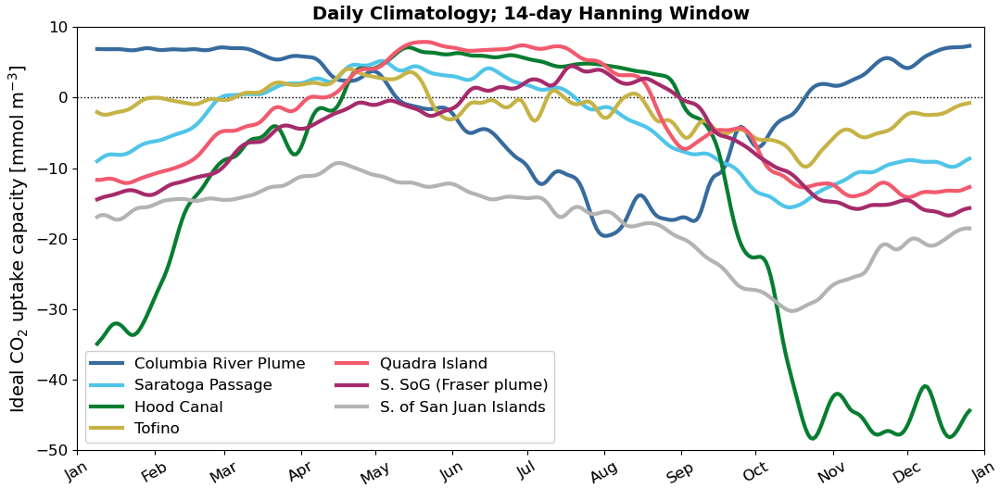 Fig 7. CO2 uptake capacity climatologies at each of the seven sites under consideration.
 

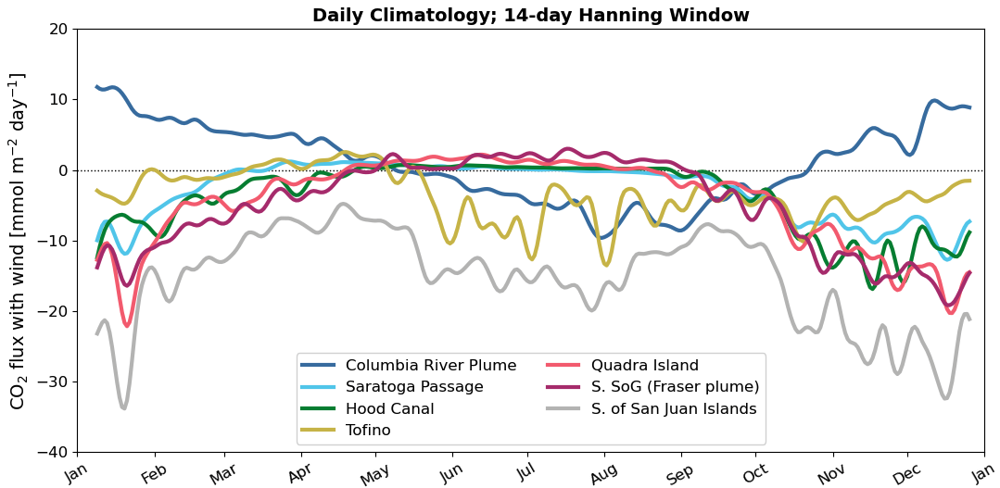 Fig 8. CO2 flux (taking into account wind) climatologies at each of the seven sites under consideration.
 

The CO2 uptake capacity sets the sign of the air-sea gas exchange, while wind speed appears to play a large role determining how much of this exchange is manifested. For instance, Hood Canal has a strong propensity to ougas CO2 during the winter based on CO2 capacity alone, but weaker winds over Hood Canal and stronger winds over S. San Juan Islands makes Hood Canal have weaker outgassing than the San Juan Islands site.

Figure 9 shows the sensitivy of CO2 flux to all state variables that could effect it for just a single day: May 22, 2020. In general, it seems that the strongest predictors for CO2 flux are a combination of wind speed and the difference in pCO2 between the atmosphere and ocean.

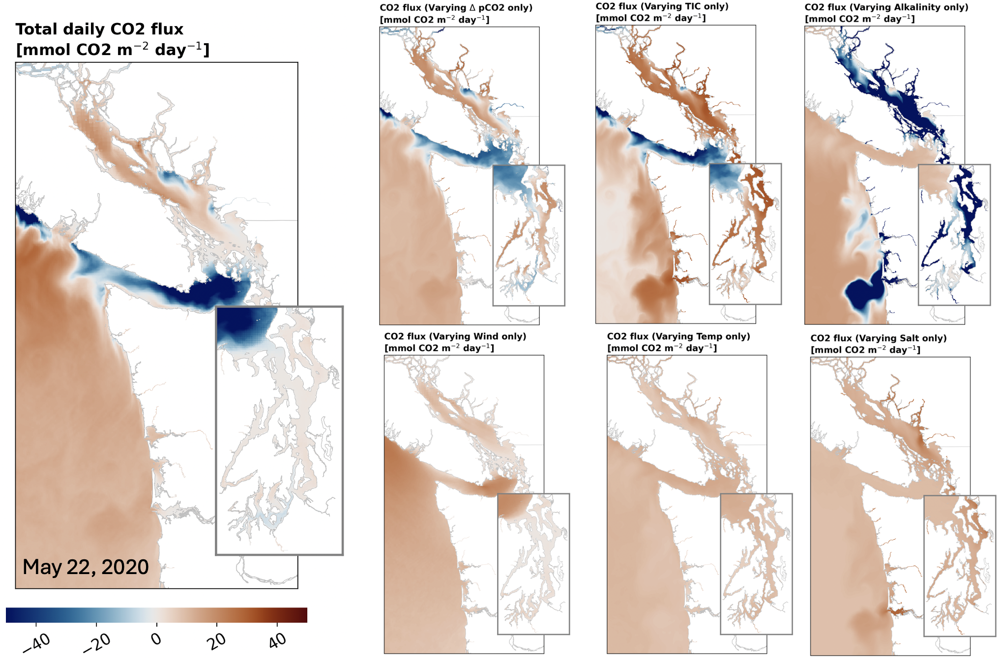 Fig 9. Sensitivity of CO2 flux to all state variables it depends upon, for a single daily average on May 22, 2020.
 

It is worth noting that sites with high CO2 uptake capacity are not necessarily good sites for OAE. Alkalinity additions will tend to increase CO2 uptake at sites that are already absorbing CO2, but it may also tend to *decrease outgassing* at sites that tend to outgas CO2. Both of these alkalinity impacts will help reduce CO2 in the atmosphere. We are considereing CO2 uptake capacity as a process parameter because these different mechanisms (increasing absorption vs. decreasing outgassing) represent opposite sides of process parameter space.

---
## Wind speed

Wind speed controls air-sea gas exchange between the surface ocean and atmopshere. With higher winds, I expect highigher CO2 fluxes. Figure 10 shows the monthly average wind speed map, using daily data pooled from 2015 - 2020.

In general, there are higher winds off the coast and south of the San Juan Islands, and slower winds in Puget Sound.

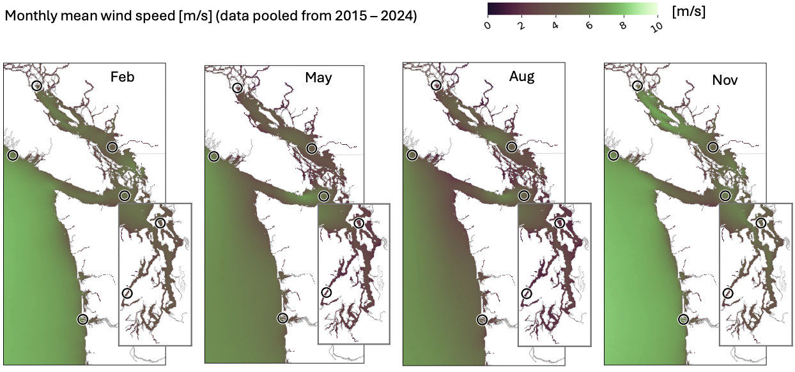 Fig 10. Average wind speed across 10 years of simulations (2015-2020) during the months of Feb, May, Aug, and Nov. Circles denote the locations of the seven sites under consideration.
 

Climatologies of wind speed at the seven sites are shown in Figure 11.

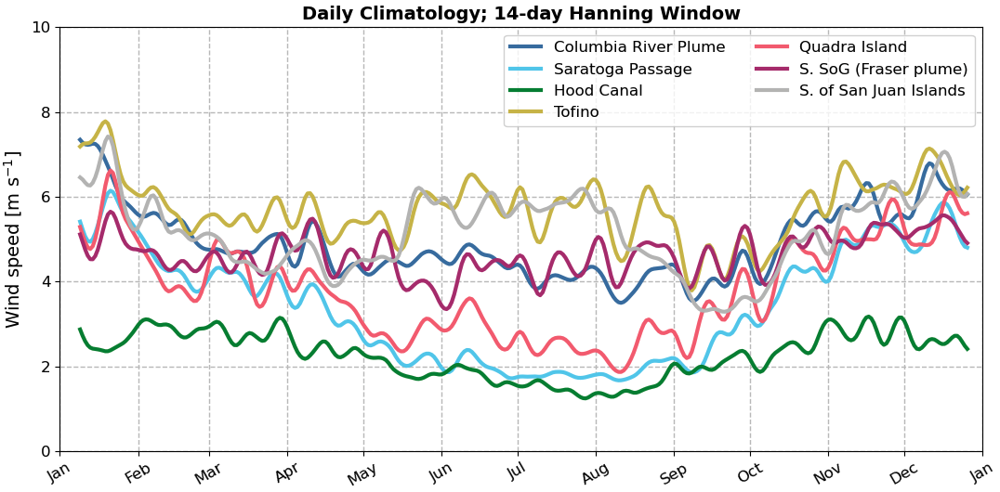 Fig 11. Wind speed climatologies at each of the seven sites under consideration.
 

Of the selected sites, Tofino and south of the San Juan Islands tend to have higher wind speeds. The Fraser plume and Columbia plume have similar magnitude wind spees, as do Saratoga Passagea and Quadra Island. There also tends to be stronger seasonal variability in wind speed at Saratoga Passage and Quadra Island compared to the other sites. Hood Canal has the weakest wind speeds compared to the other sites.

Something worth considering is whether we should include an offshore site to represent higher intensity winds. 

---
## Mixed layer depth

---
## Tidal currents

---
## Surface dye concentration

---
## Other considerations

pH
proximity to labs or industrial facilities

---
## Summary